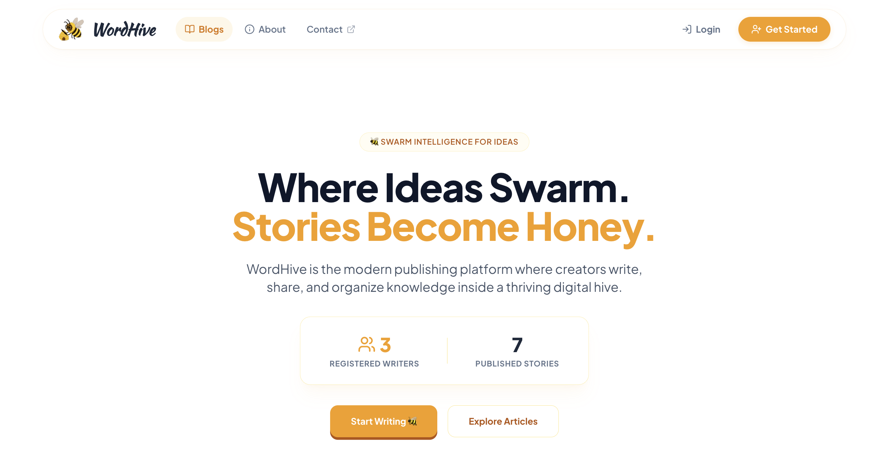

# WordHive 🐝

> A modern, responsive full-stack blogging platform engineered with the MERN stack (MongoDB, Express, React, Node.js). WordHive allows users to craft, read, edit, search, and manage stories with rich text editing, secure authentication, dynamic layout customization, and responsive media handling.

---

## 🌐 Live Demo

🔗 **[WordHive Live App](https://wordhive.vercel.app/)**

---

## 📸 Interface Preview

### Index Page Showcase



---

## ✨ Features

- 🔐 **Authentication & Security**: User register/login with JWT token authentication, HTTP-only cookies, and encrypted passwords.
- 📝 **Rich Text Publishing**: Create and edit blog posts featuring rich text styling powered by ReactQuill and image uploads.
- 🖼️ **Adaptive Media Handling**: Lazy-loaded blog cover images with fallback `ImageOff` vector badges for posts missing images.
- 🔍 **Search & Filtering**: Search stories by title/content and filter/sort posts by date or popularity.
- 🎨 **Modern SaaS UI**: Glassmorphism elements, custom scrollbars, toast notifications, responsive mobile drawer menu, and clean responsive typography.
- 📄 **Static & Meta Pages**: About Us, Contact, Terms of Service, and Privacy Policy page routes.

---

## 🛠️ Tech Stack

### Frontend
- **Framework**: React.js 18
- **Routing**: React Router v6
- **Styling**: Vanilla CSS, Flexbox/Grid, Lucide Icons (`lucide-react`)
- **Notifications**: `react-hot-toast`
- **Lazy Loading**: `react-lazy-load-image-component`
- **Rich Editor**: `react-quill`

### Backend
- **Runtime**: Node.js & Express.js
- **Database**: MongoDB with Mongoose ORM
- **Authentication**: JSON Web Tokens (JWT) & `bcryptjs`
- **Image Storage**: Cloudinary / Multer file storage

---

## 📁 Project Architecture

```bash
wordhive/
├── backend/
│   ├── config/              # Database & Cloudinary configurations
│   ├── controllers/         # API business logic handlers
│   ├── models/              # MongoDB schema definitions (User, Post)
│   ├── routes/              # Express API endpoints
│   ├── index.js             # Server entry point
│   └── package.json
├── frontend/
│   ├── public/              # Static assets & index.html
│   └── src/
│       ├── assets/          # Project images and graphics
│       ├── components/      # Reusable UI components (Header, Footer, Post, Editor, Layout, ScrollToTop)
│       ├── context/         # React Context API (UserContext)
│       ├── pages/           # Application views (IndexPage, PostPage, CreatePost, EditPost, Auth, Static pages)
│       ├── styles/          # Core CSS stylesheets (App.css, index.css, Scrollbar.css)
│       ├── App.js           # Main routing & application wrapper
│       └── index.js         # React DOM root entry
├── docs/
│   └── index_page.png       # README screenshots & assets
└── README.md
```

---

## 🚀 Getting Started

### Prerequisites

- [Node.js](https://nodejs.org/) (v16+ recommended)
- [MongoDB](https://www.mongodb.com/) instance (Local or MongoDB Atlas)
- [Cloudinary](https://cloudinary.com/) account for image uploads

---

### Installation & Local Setup

#### 1. Clone the Repository

```bash
git clone https://github.com/harshgitdeep/wordhive.git
cd wordhive
```

#### 2. Backend Setup

```bash
cd backend
npm install
```

Create a `.env` file or export environment variables:

```env
PORT=4000
MONGO_URI=your_mongodb_connection_string
JWT_SECRET=your_jwt_secret_key
CLOUDINARY_CLOUD_NAME=your_cloudinary_cloud_name
CLOUDINARY_API_KEY=your_cloudinary_api_key
CLOUDINARY_API_SECRET=your_cloudinary_api_secret
```

Start the backend server:

```bash
npm start
```

#### 3. Frontend Setup

```bash
cd ../frontend
npm install
```

Create a `.env` file in `frontend/`:

```env
REACT_APP_API_URL=http://localhost:4000
```

Start the frontend client:

```bash
npm start
```

Visit **`http://localhost:3000`** in your browser.

---

## 📡 API Reference

### Authentication
- `POST /register` – Register a new account
- `POST /login` – Authenticate user session
- `POST /logout` – Clear user session cookie
- `GET /profile` – Get authenticated user details

### Posts & Content
- `GET /post` – Retrieve all blog posts
- `POST /post` – Create a new post (Auth required)
- `GET /post/:id` – Fetch post details by ID
- `PUT /post` – Update existing post (Author required)
- `DELETE /post/:id` – Remove a post (Author required)

---

## 📄 License

This project is open source and available under the [MIT License](LICENSE).
